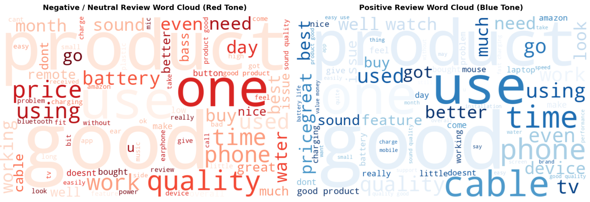
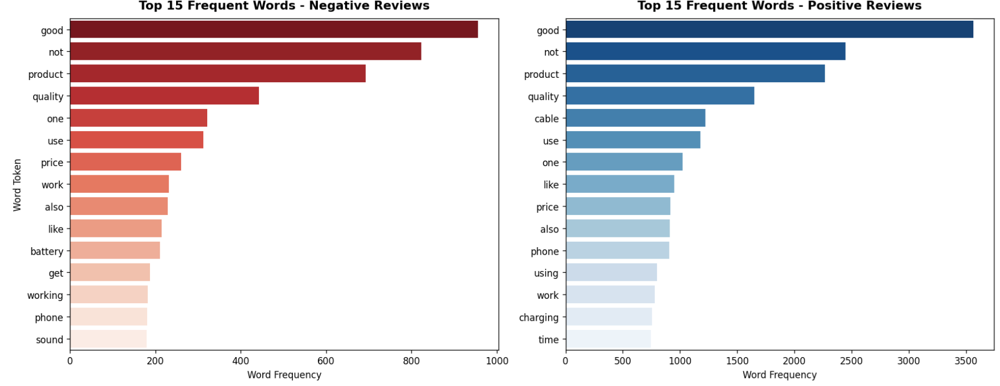
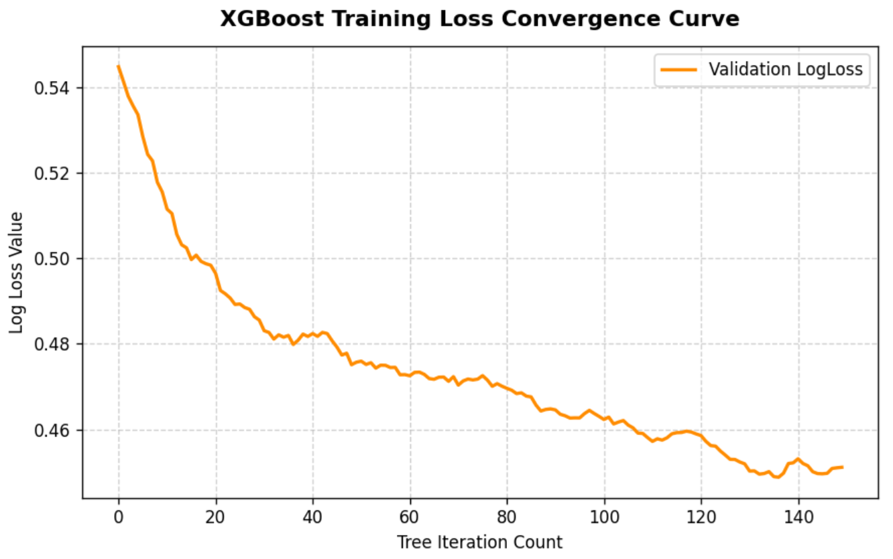

# Amazon Review Sentiment Classification
End-to-end text sentiment analysis pipeline for Amazon product reviews, comparing 3 classic machine learning models: Multinomial Naive Bayes, Linear SVM (GridSearch tuned), and XGBoost.
Kaggle Notebook: https://www.kaggle.com/code/jenniferxfl/amazon-review-sentiment-classification

## Project Overview
We build a binary sentiment classification task:
- Positive label (1): Reviews with rating ≥ 4.0
- Negative/Neutral label (0): Reviews with rating < 4.0

Full workflow:
1. Raw dataset loading & standardized text preprocessing (HTML strip, lemmatization, custom stopword filter)
2. Exploratory Data Analysis: Word clouds + top word frequency histograms
3. TF-IDF unigram+bigram text feature extraction
4. Stratified 8:1:1 train/validation/test dataset split
5. Model training & hyperparameter optimization
6. Comprehensive evaluation: classification report, confusion matrix, t-SNE feature visualization, XGBoost loss curve

## Dataset
Source: https://www.kaggle.com/datasets/karkavelrajaj/amazon-sales-dataset
Core columns used:
- `review_content`: User product review text
- `rating`: Numeric star rating for sentiment labeling

**Text Data Analysis**

**Text Data Analysis**

**Confusion Matrix for 3 Models**

**t-SNE Non-linear Dimensional Reduction on Test TF-IDF Features**

**XGBoost Validation LogLoss Convergence Curve**

