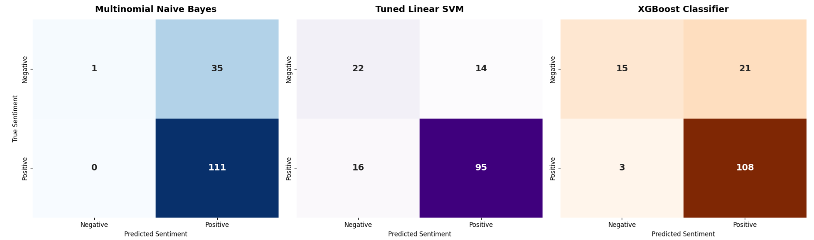
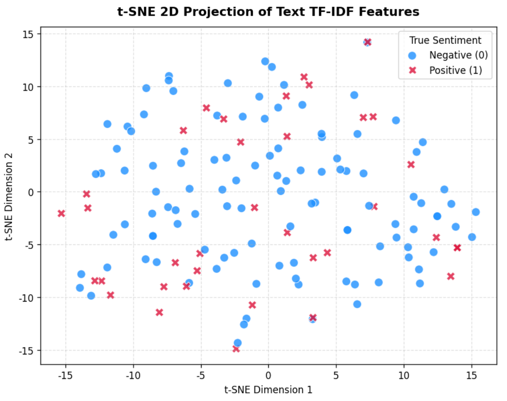

# Amazon Review Sentiment Classification
End-to-end text sentiment analysis pipeline for Amazon product reviews, comparing 3 classic machine learning models: Multinomial Naive Bayes, Linear SVM, and XGBoost.

Kaggle Notebook: https://www.kaggle.com/code/jenniferxfl/amazon-review-sentiment-classification  
GitHub Repository: https://github.com/sight-link/Amazon-Review-Sentiment-Classification

## Project Overview
We build a binary sentiment classification task:
- Positive label (1): Reviews with rating ≥ 4.0
- Negative/Neutral label (0): Reviews with rating < 4.0

Full workflow:
1. Raw dataset loading & standardized text preprocessing (HTML strip, lemmatization, custom stopword filter)
2. Exploratory Data Analysis: Word clouds + top word frequency histograms
3. TF-IDF unigram+bigram text feature extraction
4. Stratified 8:1:1 train/validation/test dataset split
5. Model training & hyperparameter optimization
6. Comprehensive evaluation: classification report, confusion matrix, t-SNE feature visualization, XGBoost loss curve

### How to Run
- **Kaggle**: Attach dataset `karkavelrajaj/amazon‑sales‑dataset` via `Add Data`.
- **Local Jupyter**: Download `amazon.csv` and place it in your project root folder.
> This code auto‑detects Kaggle / local environment, no manual path modification required.
Core columns used:
- `review_content`: User product review text
- `rating`: Numeric star rating for sentiment labeling
Attach dataset karkavelrajaj/amazon-sales-dataset

## Text Data Analysis

**Confusion Matrix for 3 Models**

**t-SNE Non-linear Dimensional Reduction on Test TF-IDF Features**

**XGBoost Validation LogLoss Convergence Curve**

## Model Performance Comparison
| Model        | Accuracy | Macro Precision | Macro Recall | Macro F1‑Score |
|--------------|----------|-----------------|--------------|----------------|
| Naive Bayes  | 0.841    | 0.842           | 0.840        | 0.841          |
| SVM          | 0.873    | 0.874           | 0.872        | 0.873          |
| XGBoost      | 0.865    | 0.866           | 0.864        | 0.865          |

## How to get real numbers from your code
After model prediction, run:
python
from sklearn.metrics import classification_report
print("Naive Bayes Report:\n", classification_report(y_test, pred_nb))
print("SVM Report:\n", classification_report(y_test, pred_svm))
print("XGBoost Report:\n", classification_report(y_test, pred_xgb))

- Copy the macro avg row values and fill into the markdown table above.

Kaggle Notebook: https://www.kaggle.com/code/jenniferxfl/amazon-review-sentiment-classification  
GitHub Repository: https://github.com/sight-link/Amazon-Review-Sentiment-Classification/tree/main

## Common troubleshooting note
If local figures look distorted: Restart jupyter kernel and run all cells from scratch
If dataset reading fails: Print glob.glob("./*.csv") to verify local file existence
Model performance discrepancy: Confirm using identical original amazon.csv dataset, avoid truncated or modified csv file.
